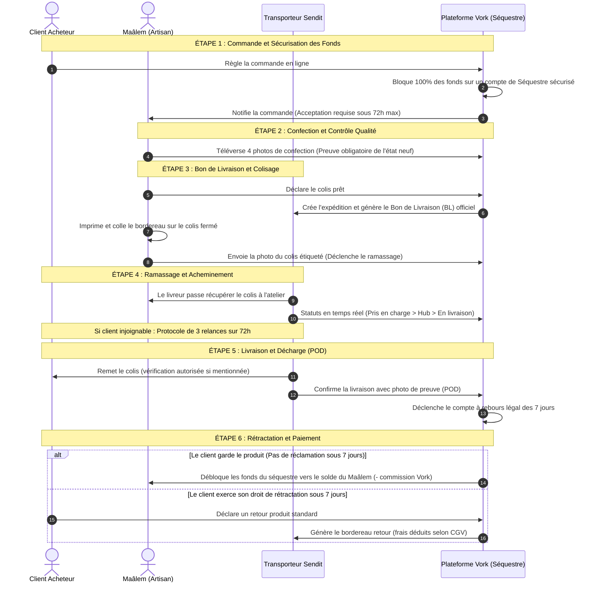

# 📦 Guide du Flux de Livraison Sendit & Règles Métier (Pour Rédaction des CGV)

> **Document destiné à la compréhension du flux opérationnel et à la mise à jour des Conditions Générales de Vente (CGV).**  
> Ce document explique simplement le parcours d'un colis Sendit, de la commande jusqu'à la libération de l'argent, les responsabilités de chacun (Artisan, Client, Sendit, Vork) et les règles à faire figurer dans les CGV.

---

## 🧭 1. Synthèse Visuelle du Flux

### Schéma Simplifié des Échanges

```text
 [ CLIENT ]                 [ ARTISAN (MAÂLEM) ]          [ SENDIT (LIVREUR) ]           [ VORK (PLATEFORME) ]
     │                              │                              │                              │
     │── 1. Paiement Commande ─────>│                              │                              │──> Fonds bloqués en Séquestre
     │                              │                              │                              │
     │                              │── 2. Confection + 4 photos ─>│                              │──> Validation atelier
     │                              │                              │                              │
     │                              │── 3. Génération Bordereau ──>│                              │──> Bordereau officiel (BL)
     │                              │   (Colis fermé + étiqueté)   │                              │
     │                              │                              │                              │
     │                              │── 4. Ordre de Ramassage ────>│                              │
     │                              │<── Enlèvement à l'atelier ───│                              │──> Statut: "En transport"
     │                              │                              │                              │
     │                              │                              │── 5. Acheminement ──────────>│──> Suivi en direct
     │                              │                              │    (Hub, Transit, Livreur)   │
     │                              │                              │                              │
     │<── 6. Remise du Colis ───────┼──────────────────────────────│                              │
     │    (+ Preuve Photo / POD)    │                              │── 7. Notification Livré ────>│──> Statut: "Livré"
     │                              │                              │                              │
     │══════════════════════════════╪══════════════════════════════╪══════════════════════════════│
     │               PÉRIODE LÉGALE DE RÉTRACTATION : 7 JOURS (Loi 31-08)                         │
     │══════════════════════════════╪══════════════════════════════╪══════════════════════════════│
     │                              │                              │                              │
     │  (Si aucun litige sous 7j)   │<── 8. Libération des Fonds ─────────────────────────────────│──> Argent versé au Maâlem
```

---

### Diagramme de Séquence Détaillé



---

## 🔍 2. Les 6 Grandes Étapes du Flux (À comprendre pour les CGV)

### Étape 1 : Commande & Séquestre Financier
* **Fonctionnement :** Dès que le client passe commande, la totalité du paiement est conservée par Vork sur un **compte de séquestre temporaire**. L'artisan ne reçoit pas l'argent tout de suite : cela protège l'acheteur en cas de non-livraison et garantit au vendeur qu'il sera payé une fois le travail fait.
* **Point CGV :** Les fonds restent indisponibles jusqu'à la confirmation de livraison effective.

### Étape 2 : Confection & 4 Photos Obligatoires
* **Fonctionnement :** L'artisan prépare l'article. Avant de pouvoir expédier, l'application lui impose d'enregistrer **4 photographies** d'atelier :
  1. Vue d'ensemble du produit fini.
  2. Gros plan sur les finitions (poinçon, couture, émail).
  3. Article dans son emballage de protection intérieur.
  4. Carton fermé prêt à partir.
* **Point CGV :** Cette étape constitue la **preuve juridique** que l'objet a été remis en parfait état au transporteur, protégeant l'artisan contre les fausses réclamations de casse.

### Étape 3 : Bon de Livraison Sendit (BL) & Ramassage
* **Fonctionnement :** 
  - L'artisan clique sur "Expédier avec Sendit". La plateforme communique avec Sendit pour attribuer un numéro de suivi unique (ex : `DH123456`) et générer un bordereau officiel au format PDF.
  - L'artisan imprime ce bordereau et le colle sur le colis.
  - L'artisan prend une photo du carton étiqueté pour commander l'enlèvement (**Pickup**). Un coursier Sendit se déplace alors directement à l'atelier de l'artisan pour récupérer le colis.
* **Point CGV :** Seuls les bordereaux officiels Sendit générés par Vork sont acceptés pour le suivi et l'assurance.

### Étape 4 : Acheminement & Gestion des Destinataires Injoignables
* **Fonctionnement :** Le colis voyage à travers le réseau Sendit (centre de tri, transit régional, puis livreur final).
* **Cas particulier — Client Injoignable (`UNREACHABLE`) :**
  - Si le client ne répond pas au téléphone au moment de la livraison, Sendit applique un protocole strict de **3 tentatives de contact réparties sur 72 heures ouvrées**.
  - Si après 72h le client reste injoignable, le colis est automatiquement retourné à l'expéditeur.
* **Point CGV :** Définir la responsabilité du client de fournir un numéro de téléphone joignable et les conséquences des frais en cas de retour pour non-réponse.

### Étape 5 : Remise du Colis & Preuve de Livraison (POD)
* **Fonctionnement :** Le livreur Sendit remet le colis en main propre contre décharge. Le livreur prend une **photographie de preuve de livraison** ou fait signer le destinataire.
* **Option ouverture colis :** Par défaut, l'ouverture du carton pour vérifier l'intégrité de la création artisanale est permise.
* **Point CGV :** Le statut `DELIVERED` validé par Sendit fait **foi juridique** de la date et de l'heure de transfert de propriété et de risques.

### Étape 6 : Délai Légal de Rétractation (7 jours) & Déblocage des Fonds
* **Fonctionnement :**
  - Conformément à la législation marocaine (**Loi n° 31-08**, article 36), le client bénéficie d'un délai de **7 jours francs** à compter de la date de livraison pour exercer son droit de rétractation sur les produits standards.
  - Pendant ces 7 jours, les fonds restent en séquestre.
  - Le 8ᵉ jour, en l'absence de contestation, Vork transfère automatiquement les fonds du séquestre vers le solde bancaire de l'artisan (déduction faite de la commission de service de 5% HT + TVA).
* **Point CGV :** Les créations personnalisées ou réalisées sur-mesure sont légalement exclues du droit de rétractation de 7 jours (Art. 38 Loi 31-08).

---

## ⚖️ 3. Modèle de Clauses Prêtes à l'Emploi pour les CGV

Voici les articles rédigés dans un style juridique clair que votre camarade peut directement reprendre ou ajuster :

```markdown
### ARTICLE 8 — CONDITIONS D'EXPÉDITION PAR TRANSPORTEUR (SENDIT)

8.1. Éligibilité
L'expédition par le transporteur partenaire Sendit s'applique exclusivement aux commandes de Produits Standards. Les produits volumineux ou sur-mesure peuvent faire l'objet d'un mode de remise directe convenu entre les parties.

8.2. Obligations d'emballage et étiquetage du Vendeur
Le Vendeur s'engage à conditionner le produit avec les protections adaptées à sa fragilité artisanale. Il a l'obligation préalable de consigner l'état de l'article au moyen de quatre (4) photographies d'atelier et d'apposer de façon visible et lisible le Bordereau de Livraison (BL) officiel émis par la Plateforme.

8.3. Prise en charge et Force probante du suivi
Le colis est pris en charge lors de son enlèvement à l'atelier par le préposé Sendit. Les informations de géolocalisation, scans d'étapes et horodatages émis par les systèmes de Sendit font pleine foi entre le Vendeur, l'Acheteur et la Plateforme quant à l'acheminement du colis.

8.4. Destinataire absent ou injoignable
En cas d'impossibilité de joindre le destinataire lors de la présentation du colis, le transporteur applique une procédure de relance téléphonique et SMS sur une durée maximale de soixante-douze (72) heures ouvrées (trois tentatives). Si le colis ne peut être remis du fait de la défaillance du Client, le colis sera retourné au Vendeur et les frais de retour pourront être imputés au Client.

8.5. Preuve de Livraison (POD)
La livraison est réputée parfaite à compter de l'enregistrement du statut "Livré" (DELIVERED) par Sendit, attesté par la photographie de décharge ou le récépissé de remise.


### ARTICLE 12 — SÉQUESTRE DU PAIEMENT ET DÉLAI DE RÉTRACTATION

12.1. Séquestre temporaire de garantie
Le montant intégral de la commande est conservé sous séquestre par la Plateforme pendant la phase de fabrication, d'expédition et durant le délai légal de rétractation.

12.2. Délai de rétractation (Loi n° 31-08)
Pour tout Produit Standard, le Client consommateur dispose d'un délai de sept (7) jours francs à compter de la réception physique du bien constatée par Sendit pour notifier sa décision de rétractation sans avoir à justifier de motif.
*Exception légale :* Conformément aux dispositions de l'article 38 de la Loi 31-08, le droit de rétractation ne peut être exercé pour les produits confectionnés sur-mesure ou nettement personnalisés à la demande du Client.

12.3. Libération et versement des fonds au Maâlem
À l'expiration du délai de sept (7) jours francs suivant la livraison sans notification d'incident ou de demande de retour, la commande est définitivement clôturée. La Plateforme procède au déblocage du séquestre et crédite le solde du Vendeur, déduction faite des commissions d'intermédiation convenues.
```

---

## 📌 4. Tableau Récapitulatif des Responsabilités

| Sujet | Artisan (Maâlem) | Client Acheteur | Transporteur Sendit | Plateforme Vork |
| :--- | :--- | :--- | :--- | :--- |
| **Préparation** | Emballage sécurisé + 4 photos d'atelier | Renseigner adresse & tél exacts | Fournit le bordereau PDF | Génère le BL & enregistre les photos |
| **Ramassage** | Coller le BL et remettre au coursier | En attente de notification | Vient chercher le colis à l'atelier | Met à jour le statut en "En cours de transport" |
| **Transport** | Suit le colis sur l'app | Reste joignable par téléphone | Assure l'acheminement sécurisé | Trace chaque étape en temps réel |
| **Remise** | Notifié de la livraison | Réceptionne et vérifie le colis | Prend la photo de preuve (POD) | Enregistre le statut "Livré" |
| **Argent** | Reçoit les fonds à J+7 | Délai de 7 jours pour tester/vérifier | N/A | Garde l'argent sous séquestre puis débloque |
